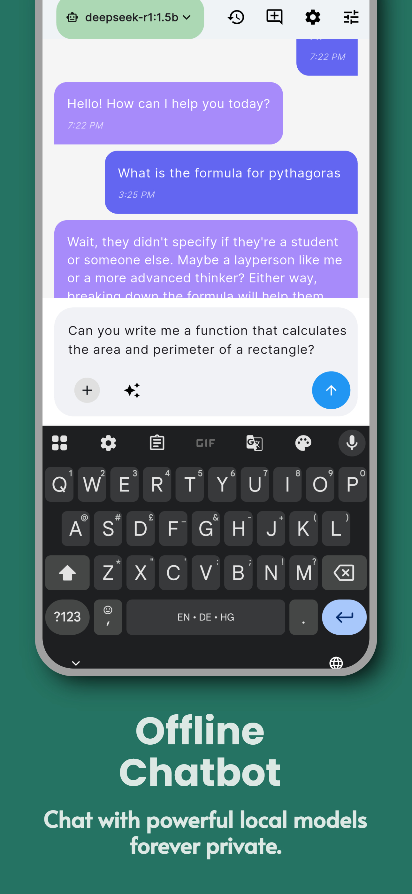
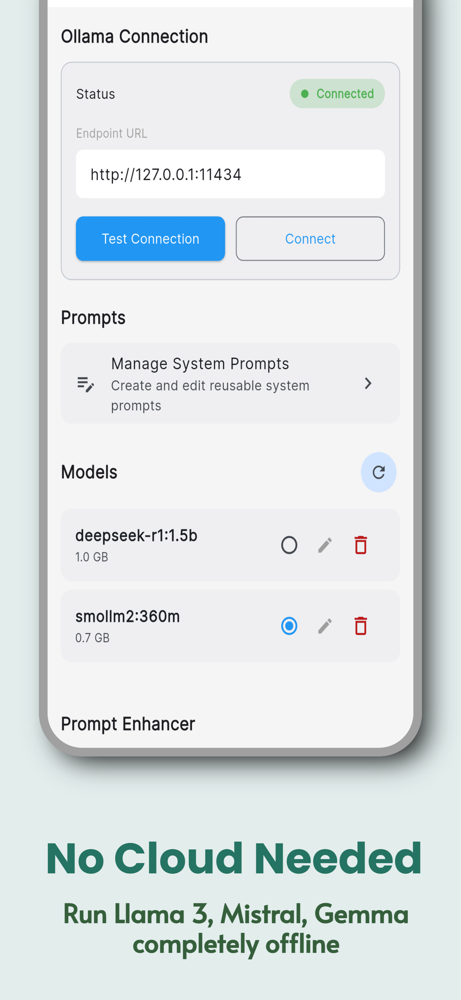
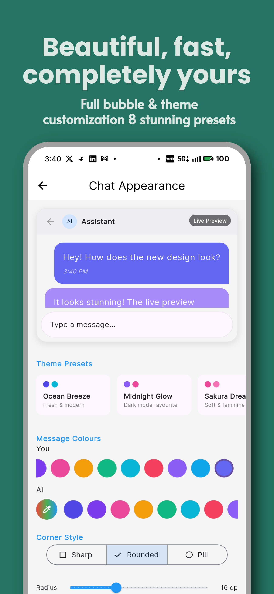
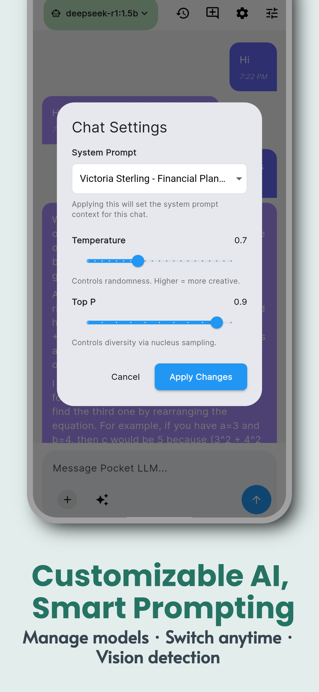

# PocketLLM Lite

[![zread](https://img.shields.io/badge/Ask_Zread-_.svg?style=for-the-badge&color=00b0aa&labelColor=000000&logo=data%3Aimage%2Fsvg%2Bxml%3Bbase64%2CPHN2ZyB3aWR0aD0iMTYiIGhlaWdodD0iMTYiIHZpZXdCb3g9IjAgMCAxNiAxNiIgZmlsbD0ibm9uZSIgeG1sbnM9Imh0dHA6Ly93d3cudzMub3JnLzIwMDAvc3ZnIj4KPHBhdGggZD0iTTQuOTYxNTYgMS42MDAxSDIuMjQxNTZDMS44ODgxIDEuNjAwMSAxLjYwMTU2IDEuODg2NjQgMS42MDE1NiAyLjI0MDFWNC45NjAxQzEuNjAxNTYgNS4zMTM1NiAxLjg4ODEgNS42MDAxIDIuMjQxNTYgNS42MDAxSDQuOTYxNTZDNS4zMTUwMiA1LjYwMDEgNS42MDE1NiA1LjMxMzU2IDUuNjAxNTYgNC45NjAxVjIuMjQwMUM1LjYwMTU2IDEuODg2NjQgNS4zMTUwMiAxLjYwMDEgNC45NjE1NiAxLjYwMDFaIiBmaWxsPSIjZmZmIi8%2BCjxwYXRoIGQ9Ik00Ljk2MTU2IDEwLjM5OTlIMi4yNDE1NkMxLjg4ODEgMTAuMzk5OSAxLjYwMTU2IDEwLjY4NjQgMS42MDE1NiAxMS4wMzk5VjEzLjc1OTlDMS42MDE1NiAxNC4xMTM0IDEuODg4MSAxNC4zOTk5IDIuMjQxNTYgMTQuMzk5OUg0Ljk2MTU2QzUuMzE1MDIgMTQuMzk5OSA1LjYwMTU2IDE0LjExMzQgNS42MDE1NiAxMy43NTk5VjExLjAzOTlDNS42MDE1NiAxMC42ODY0IDUuMzE1MDIgMTAuMzk5OSA0Ljk2MTU2IDEwLjM5OTlaIiBmaWxsPSIjZmZmIi8%2BCjxwYXRoIGQ9Ik0xMy43NTg0IDEuNjAwMUgxMS4wMzg0QzEwLjY4NSAxLjYwMDEgMTAuMzk4NCAxLjg4NjY0IDEwLjM5ODQgMi4yNDAxVjQuOTYwMUMxMC4zOTg0IDUuMzEzNTYgMTAuNjg1IDUuNjAwMSAxMS4wMzg0IDUuNjAwMUgxMy43NTg0QzE0LjExMTkgNS42MDAxIDE0LjM5ODQgNS4zMTM1NiAxNC4zOTg0IDQuOTYwMVYyLjI0MDFDMTQuMzk4NCAxLjg4NjY0IDE0LjExMTkgMS42MDAxIDEzLjc1ODQgMS42MDAxWiIgZmlsbD0iI2ZmZiIvPgo8cGF0aCBkPSJNNCAxMkwxMiA0TDQgMTJaIiBmaWxsPSIjZmZmIi8%2BCjxwYXRoIGQ9Ik00IDEyTDEyIDQiIHN0cm9rZT0iI2ZmZiIgc3Ryb2tlLXdpZHRoPSIxLjUiIHN0cm9rZS1saW5lY2FwPSJyb3VuZCIvPgo8L3N2Zz4K&logoColor=ffffff)](https://zread.ai/PocketLLM/pocketllm-lite)

---


A premium, privacy-first, offline AI chat application for Android/iOS, integrating with Ollama via Termux. Experience powerful AI models directly on your device with a beautiful, customizable interface.

## 📸 App Screenshots

<div style="display: flex; flex-wrap: wrap; gap: 10px;">





</div>

## 🚀 Key Features

*   **Offline AI**: Zero data latency. All chats processed locally via Ollama.
*   **Multimedia Support**: Vision-capable chat (e.g., Llama 3.2 Vision, Llava).
*   **Media Gallery**: Browse all shared images globally or per chat.
*   **File Attachments**: Attach text/code files for context-aware answers.
*   **Premium Customization**:
    *   **Live Preview**: Theme your chat bubbles, create presets, and adjust corner radius.
    *   **Dynamic Chat History**: Rename, bulk delete, and organize chats.
    *   **System Prompts**: 15+ rich presets (Productivity Coach, Fitness Trainer, etc.).
*   **Tag Management**: Organize chats with tags and bulk tagging tools.
*   **Interactive UI**: Fully native Material 3 design with haptic feedback, smooth animations, and a focused menu for messages.
*   **Markdown Support**: Full rendering for code blocks, tables, and links.
*   **Privacy Centric**: History stored locally using secure Hive database.

## 🛠 Prerequisites

1.  **Flutter SDK** (Channel stable).
2.  **Android Device** (Recommended for Ollama/Termux) or Emulator.
3.  **Termux** (For running Ollama server on Android).

## 📱 Termux & Ollama Setup (Android)

To run the AI engine locally on your phone:

1.  **Install Termux**: Download from F-Droid (Google Play version is outdated).
2.  **Install Ollama**:
    ```bash
    pkg update && pkg upgrade
    pkg install ollama
    ```
3.  **Start Server**:
    ```bash
    ollama serve
    ```
4.  **Download a Model** (Open a new session):
    ```bash
    ollama pull llama3.2    # Or any other model
    ```

**Note**: Ensure `ollama serve` is running in the background while using the app.

## 💻 Build Instructions

1.  **Install Dependencies**:
    ```bash
    flutter pub get
    ```
2.  **Generate Code** (required for Hive adapters):
    ```bash
    dart run build_runner build --delete-conflicting-outputs
    ```
3.  **Run Application**:
    ```bash
    flutter run
    ```
4.  **Build Release APK** (with ProGuard & Dart obfuscation):
    ```bash
    # Windows
    build_release.bat
    
    # Linux/macOS
    chmod +x build_release.sh && ./build_release.sh
    
    # Or manually:
    flutter build apk --release --obfuscate --split-debug-info=./debug_symbols
    ```
5.  **Build Release App Bundle** (for Google Play Store):
    ```bash
    flutter build appbundle  --release  --obfuscate  --split-debug-info=./debug_symbols  --no-tree-shake-icons    
    ```

## 🔒 Security (ProGuard & Obfuscation)

The app uses ProGuard/R8 for Android and Dart obfuscation for enhanced security:

### What's Enabled
- **Code Shrinking**: Removes unused code, reducing APK size
- **Optimization**: Optimizes bytecode for better performance
- **Obfuscation**: Renames classes and methods to make reverse-engineering harder
- **Resource Shrinking**: Removes unused resources

### Custom ProGuard Rules
Edit `android/app/proguard-rules.pro` to add custom keep rules if needed.

### Debug Symbols
The `debug_symbols/` folder contains symbol files for deobfuscating crash reports:
```bash
# To symbolicate a stack trace
flutter symbolize -i <crash_log> -d debug_symbols/
```

**Important**: Keep the `debug_symbols/` folder for each release to debug production crashes.

## 🔐 Security Fixes

Recent security improvements have been implemented to ensure compliance with Google Play Store policies:

### Debug Logging Removal
- All debug print statements have been removed or guarded with `kDebugMode` checks
- No sensitive information is exposed in production builds

### Privacy Policy Updates
- Clarified that data is stored in secure local Hive databases (on-device storage)
- Added note that data is stored locally in app sandbox with no encryption by default, but protected by device security
- Added information that the app uses HTTP for local Ollama communication (localhost:11434) only—no external data sent

### Network Documentation
- Added clarification that the app uses HTTP for local Ollama communication (localhost:11434) only—no external data sent

### App Signing Fix
- Implemented proper release signing configuration with keystore.properties template
- Added fallback to debug signing for development environments
- Signing configuration loads from keystore.properties if exists, otherwise falls back to debug for dev

### Permissions Review
- Explicitly declared only needed permissions: INTERNET (for ads/Ollama), CAMERA, and READ_EXTERNAL_STORAGE (for images)
- Removed any implicit permissions

### License Compliance
- Added Third-Party Licenses section listing all dependencies with links
- Added command to generate licenses.txt: `flutter pub deps --style=compact > licenses.txt`

## 🏗 Architecture & Tech Stack

*   **Framework**: Flutter (Dart)
*   **State Management**: Riverpod (Providers & Notifiers)
*   **Storage**: Hive (NoSQL, box-based persistence)
*   **Navigation**: GoRouter
*   **Theme**: Material 3 (Dynamic Color Support)
*   **Integration**: Custom HTTP client for Ollama Streaming API

## 📂 Project Structure

```
lib/
├── core/               # Global constants, themes, router
│   ├── constants/      # App-wide constants and presets
│   ├── theme/          # Theme definitions and providers
│   ├── widgets/        # Shared UI components
│   └── router.dart     # Application routing configuration
├── features/           # Feature modules
│   ├── chat/           # Chat logic, UI, and bubbles
│   │   ├── domain/     # Data models and business logic
│   │   └── presentation/ # Screens, widgets, and providers
│   ├── media/          # Media gallery features
│   ├── history/        # Chat history management
│   ├── onboarding/     # First-time user experience
│   ├── profile/        # User profile customization
│   ├── settings/       # App configuration and customization
│   ├── tags/           # Tag management UI
│   └── splash/         # Initial loading screen
├── services/           # OllamaService, StorageService
└── main.dart           # Application entry point
```

## 🎯 Core Features

### Chat Interface
- Real-time streaming responses from Ollama models
- Support for multimodal inputs (text and images)
- Attach text files as context ("RAG-lite")
- Interactive message bubbles with copy/share options
- Message editing and regeneration workflows
- Markdown rendering for rich text formatting
- System prompt integration for specialized behaviors

### Chat History
- Persistent local storage using Hive
- Organize chats with custom names and tags
- Bulk operations for managing multiple conversations
- Search functionality to find specific conversations
- Global media gallery for chat images

### Customization
- Dynamic theme switching (light/dark mode)
- Adjustable chat bubble appearance (colors, radius, opacity)
- Font size customization
- Avatar visibility toggle
- Background color options
- Profile customization (display name and avatar color)

### Settings Management
- Ollama endpoint configuration
- Default model selection
- System prompt management
- Privacy controls
- Haptic feedback preferences

### Prompt Enhancer
- AI-powered prompt improvement using any Ollama model
- Fixed system prompt optimized for best enhancement results
- 5 free enhancements per 24 hours (watch ad to unlock more)

## 🧩 Media, Tags, and Attachments

- **Media Gallery**: Open **Settings → Media Gallery** to browse every image shared across chats, or tap the gallery icon in a chat to view media for that conversation.
- **Tag Management**: Use **Settings → Tag Management** to rename or delete tags globally.
- **File Attachments**: Tap the paperclip in the chat input to attach text files (TXT/MD/JSON/CSV/LOG). Attachments are injected into the prompt locally for context.
- **Attachment Limits**: Text attachments are limited to 200KB each to keep prompts fast and responsive.

## 💰 Monetization (AdMob)

The app includes Google AdMob integration for monetization through banner and rewarded ads.

### Setup for Production

1. **Get AdMob IDs**: Create an account at [AdMob Console](https://admob.google.com/)
2. **Android App ID**: Add `admobAppId` to your `key.properties` file (same file as signing keys):
   ```properties
   admobAppId=ca-app-pub-xxxxxxxxxxxxxxxx~yyyyyyyyyy
   ```
   Alternatively, set the `ADMOB_APP_ID_ANDROID` environment variable.
3. **Ad Unit IDs**: Pass IDs via `--dart-define` when building:
   ```bash
   flutter build apk --dart-define=ADMOB_BANNER_ID=ca-app-pub-xxx/yyy --dart-define=ADMOB_REWARDED_ID=...
   ```
   (If not provided, the app will use Google Test IDs).
4. **iOS Setup**: Add `GADApplicationIdentifier` to `ios/Runner/Info.plist`

### Usage Limits
- **Prompt Enhancements**: 5 free per 24 hours, watch rewarded ad for 5 more
- **Token System**: 10,000 initial tokens, watch rewarded ad for +10,000
- **Banner Ads**: Displayed at bottom of Settings screen

**Note**: Test IDs are pre-configured for development. Always use test IDs during development to avoid policy violations.

## ⚙️ Configuration Options

### Ollama Connection
- **Endpoint**: Default `http://127.0.0.1:11434` (configurable in settings)
- **Model Management**: Pull, delete, and list available models
- **API Integration**: Direct HTTP communication with Ollama REST API

### Appearance Settings
- **Theme Mode**: Light/Dark/System preference
- **Chat Styling**: 
  - User/AI message colors
  - Bubble corner radius (0-20)
  - Font size (12-24)
  - Message opacity (0.5-1.0)
  - Bubble elevation (shadow effect)
- **Layout Options**:
  - Chat padding adjustment
  - Avatar visibility toggle
  - Background color customization

### Behavior Settings
- **Auto-save**: Toggle automatic chat saving
- **Haptic Feedback**: Enable/disable tactile responses
- **Default Model**: Set primary model for new chats

## 🔧 Technical Implementation Details

### State Management
The application uses Riverpod for state management with a combination of:
- `NotifierProvider` for complex state logic
- `FutureProvider` for asynchronous data loading
- `StateProvider` for simple state values

### Data Persistence
Hive is used for all local data storage:
- **ChatBox**: Stores chat sessions and messages
- **SettingsBox**: Persists user preferences
- **SystemPromptsBox**: Manages custom system prompts

### Routing
GoRouter with ShellRoute provides:
- Bottom navigation between main sections
- Nested routes for settings sub-screens
- Type-safe navigation with path parameters

### Networking
Custom HTTP client implementation for:
- Streaming responses from Ollama chat API
- Model listing and management
- Connection health checks

## 🧪 Usage Examples

### Starting a Chat
1. Navigate to the Chat tab
2. Select a model from the dropdown
3. Type your message or attach an image
4. Press send to initiate the conversation

### Customizing Appearance
1. Go to Settings > Customization
2. Adjust sliders for bubble radius, font size, and opacity
3. Use color pickers to set message colors
4. Toggle avatar visibility and other layout options

### Managing Chat History
1. Visit the History tab
2. Long-press on chats for bulk operations
3. Use the search bar to find specific conversations
4. Tap the rename icon to customize chat titles

### Configuring Ollama
1. Access Settings > Connection
2. Update the Ollama endpoint URL if needed
3. Select your preferred default model
4. Test the connection to verify settings

## 📱 Platform Support

- **Android**: Primary target platform with Termux integration
- **iOS**: Supported with manual Ollama setup
- **Desktop**: Experimental support via Flutter desktop

## 📜 License

This project is licensed under the MIT License - see the LICENSE file for details.

The MIT License is a permissive open-source license that allows for commercial use, modification, distribution, and patent use, with the only requirement being that the original copyright notice and license text be included in all copies or substantial portions of the software.

## 📞 Support

For support, feature requests, or bug reports, please:
1. Contact the development team
2. Include your platform, Flutter version, and steps to reproduce

## 🙏 Acknowledgments

- Thanks to the Ollama team for enabling local AI inference
- Gratitude to the Flutter community for excellent documentation and packages
- Appreciation to all contributors and early adopters
