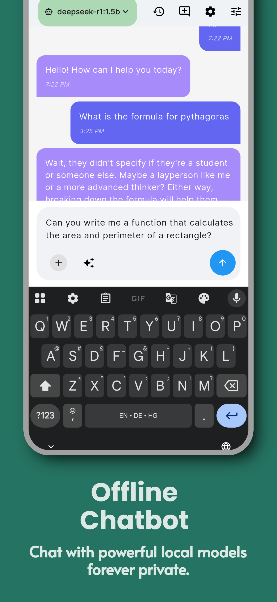
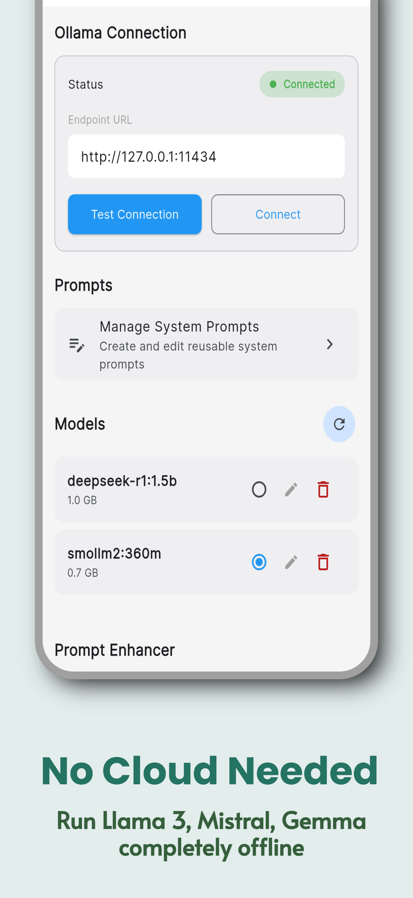
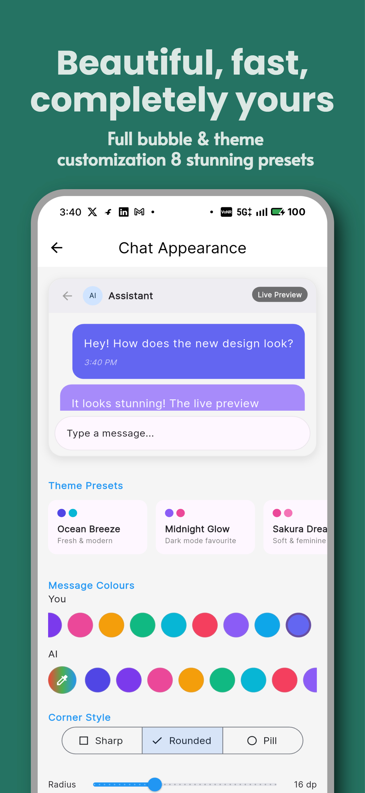
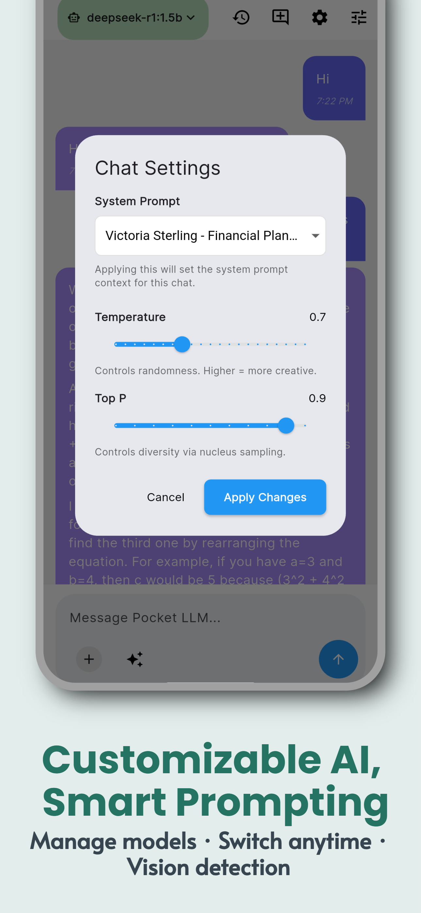

<p align="center">
  
</p>

<h1 align="center">PocketLLM Lite</h1>

<p align="center">
  <a href="https://zread.ai/PocketLLM/pocketllm-lite">
    
  </a>
</p>

---

<p align="center">
  
</p>

<p align="center">
  PocketLLM Lite is an ultra-premium, privacy-first <strong>offline AI chat application</strong> for Android, iOS, and Desktop. By seamlessly bridging local on-device inference with <strong>Ollama via Termux</strong> (Android) or native macOS/Linux pipelines, it enables running state-of-the-art <strong>Local Large Language Models (LLMs)</strong> like DeepSeek-R1, Llama 3.2, and Phi-3 completely offline—safeguarding your digital sovereignty with zero external data telemetry.
</p>

<p align="center">
  Designed with an exquisite, fluid <strong>Material 3 Expressive Design System</strong>, PocketLLM Lite delivers lightning-fast offline completions, advanced Retrieval-Augmented Generation (RAG) document ingestion, local TTS/STT, a native agentic tool execution system, and a robust open-standard Agent Skills runtime!
</p>

---

## 📸 Premium Experience in Action

<div style="display: flex; flex-wrap: wrap; gap: 12px; margin-bottom: 20px;">
  
  
  
  
  
</div>

---

## 💎 Outstanding Feature Architecture

### 🧩 1. Open-Standard Agent Skills Runtime (`SKILL.md`) (New!)
PocketLLM Lite now includes a robust **Agent Skills System** built on standard `SKILL.md` open formats. You can expand your offline assistant's capabilities dynamically:
*   **One-Tap GitHub Installer**: Install complex agent skills directly from any GitHub or raw `SKILL.md` URL. The engine handles redirects to raw content and parses YAML frontmatter and markdown instructions instantly.
*   **Manual CRUD Creator**: Author and design customized skills offline using premium Material 3 sheets and input validation.
*   **Smart Autocomplete Suggester**: Typing `/` inside the chat bar triggers a horizontal recommended skills chip panel.
*   **In-Input Highlights & Cursor Navigation**: Skill trigger words like `/webdesign` are highlighted in bold blue inside your text field. Tapping a highlighted token redirects you to its detailed instructions.
*   **Dynamic Context Injection**: The inference pipeline automatically scans your query, reads matching active skill markdown instructions, and injects them into system prompts before generating a reply.

### 🤖 2. Privacy-First Local Inference Pipeline
*   **Complete Offline Completion**: 100% on-device inference with zero cloud dependencies. No chat logs, API credentials, or behavioral metrics ever leave your phone.
*   **DeepSeek-R1 Chain-of-Thought Accoridon**: Native streaming support for `<think>` reasoning tags, rendered in a beautifully animated Material 3 collapsible accordion.
*   **Dynamic AI Personas**: Save system instructions with distinct emoji avatars, temperature overrides, and default LLM bindings. Includes a scrollable persona switcher HUD.
*   **Knowledge Base RAG**: Process and query offline vector store databases (PDF, TXT, CSV) to automatically augment prompts with secure local contexts.
*   **Vision & Multimodal Support**: Attach camera snapshots or gallery images directly to multimodal LLMs (e.g. Llama 3.2 Vision).

### ⚙️ 3. Native Agentic Tool Calling System
Enable agentic capabilities to let local models execute offline code tools:
*   **Offline Calculator**: Solves complex and basic mathematical equations.
*   **System Diagnostics**: Queries native OS platforms, dates, times, and zones.
*   **Offline Knowledge Search**: Provides simulated general reference knowledge.

### 🎙️ 4. Offline Voice Dictation & Text-to-Speech
*   **Dictation (STT)**: Dictate your prompts offline using an animated bottom microphone HUD.
*   **Speak Back (TTS)**: Single-tap speak chips to read any AI completion aloud using offline native speech engines.

---

## 💻 Termux & Local Ollama Setup (Android)

To run the offline local inference engines directly on your Android device:

1.  **Install Termux**: Download from [F-Droid](https://f-droid.org/packages/com.termux/) (the Google Play version is obsolete).
2.  **Install & Setup Ollama**:
    ```bash
    pkg update && pkg upgrade
    pkg install ollama
    ```
3.  **Launch Ollama Server**:
    ```bash
    ollama serve
    ```
4.  **Download Local Models** (open a new Termux session):
    ```bash
    # Pull DeepSeek R1 1.5B Reasoning Model
    ollama pull deepseek-r1:1.5b
    
    # Pull Llama 3.2 3B Text Model
    ollama pull llama3.2
    ```
5.  **Connect PocketLLM**: Launch the app, navigate to **Settings**, configure your endpoint URL (usually `http://127.0.0.1:11434`), and tap **Connect**.

---

## 💻 Local Development & Build Directions

### 1. Retrieve Dependencies
```bash
flutter pub get
```

### 2. Generate Serializers & Adapters (Hive box support)
```bash
dart run build_runner build --delete-conflicting-outputs
```

### 3. Debug Launching
```bash
flutter run
```

### 4. Build Optimized Production APK (Obfuscated & Shrinked)
```bash
# Windows
build_release.bat

# Linux/macOS
chmod +x build_release.sh && ./build_release.sh

# Manual Execution:
flutter build apk --release --obfuscate --split-debug-info=./debug_symbols
```

---

## 🔒 Production Security & Hardening

*   **Dart Obfuscation & R8/ProGuard**: Production builds are heavily obfuscated to strip debug symbol indices, rename classes, and compress asset footprints.
*   **Secure Local Box Sandbox**: Chat database boxes are stored in native application sandboxes, protected by OS-level permissions.
*   **Sanitized Telemetry**: Legacy advertising monetization libraries, Google AdMob SDK hooks, and tokens usage trackers are completely removed, establishing a clean offline client.
*   **Cleartext Permissions**: Only network-loopback permissions (for Ollama communication at `localhost:11434`), camera access, and sandbox reads are requested.

---

## 🏗 High-Fidelity Tech Stack

*   **Logic Framework**: Flutter & Dart Stable Engine
*   **State Management**: Riverpod 3 (StateNotifiers & async NotifierProviders)
*   **NoSQL Local Storage**: Hive CE (Community Edition, fast binary serialization)
*   **Nav Systems**: GoRouter with nested ShellRoutes and animation transitions
*   **Design Foundations**: Material Design 3 (Seed HSL colors, dynamic color schemes)
*   **Streaming**: Direct custom HTTP stream parser supporting Chunked Transfer encodings

---

## 📂 Modular Structure Overview

```
lib/
├── core/               # Global configurations, router, and themes
│   ├── constants/      # App-wide constants, system presets, and prompts
│   ├── theme/          # Dynamic Material 3 styling engine
│   └── widgets/        # Shared core widgets (M3AppBar, M3Avatar, M3EmptyState)
├── features/           # Feature-driven domain modules
│   ├── chat/           # Prompts inputs, bubbles, and autocomplete logic
│   │   ├── domain/     # Data models (ChatMessage, ChatSession, Skill, Persona)
│   │   └── presentation/ # Chat UI, management screens, and state providers
│   ├── media/          # Global media gallery grids
│   ├── profile/        # Personalized user profile configurations
│   ├── settings/       # Appearance sliders, benchmarker, and updates HUD
│   ├── tags/           # Tag organization screens
│   └── splash/         # Native launch and loading handlers
└── services/           # Underlying storage, Ollama, and update layers
```

---

## 🤝 Open-Source License & Support

PocketLLM Lite is licensed under the permissive **MIT License**—enabling absolute freedom to copy, inspect, modify, fork, or redistribute.

If you encounter performance issues with local weights execution, have questions regarding setup configurations, or would like to contribute:
1. File a bug report in the development workspace.
2. Include your specific device specifications (RAM/CPU/GPU) and active Termux packages.
3. Reach out to the core engineering team.

---
*PocketLLM Lite is crafted with 💜 using Flutter. Offline AI for everyone.*
